# LockBit 3.0 🔒

**Fileless ransomware using PowerShell reflective DLL injection**

Extracted payload from memory mid-execution, reverse engineered the API hashing algorithm (XOR 0x11039ffe), and documented WMI-based shadow copy deletion that bypasses command-line monitoring.

**Signature:** aPLib compression (BlackMatter lineage) | **Evasion:** Stack string obfuscation, offline encryption

---

## 🎯 What Makes This Interesting

LockBit 3.0 never touches disk. PowerShell dropper injects a DLL directly into memory, encrypts your files offline (no C2 needed), and deletes backups through WMI instead of vssadmin.exe - bypassing most security monitoring.

**Key capabilities:**
- 🚫 Fileless execution - reflective DLL injection
- 🔐 AES-256 encryption with unique per-file keys
- 🗑️ WMI-based shadow copy deletion (evades command-line detection)
- 🎭 API hashing to hide Windows function calls
- 📦 aPLib compression (BlackMatter signature)
- ⚡ Offline mode - generates keys locally, no C2 traffic

---

## 📦 Sample Info

| Property | Value |
|----------|-------|
| **Dropper** | hi.ps1 (PowerShell script) |
| **Payload** | 15b10000.dll (136 KB) |
| **MD5** | `45e96801cff21b46219f5b4251ffe34B` |
| **SHA256** | `e44b6dce31d573442d95408c9d3463a144e2e6cbf47ac3a76e389c3cf7345ecf` |
| **Architecture** | i386 (32-bit) |
| **Ransom Extension** | `.8Fp4QiPet` |
| **Family** | LockBit 3.0 / LockBit Black |

---

## 🔄 Execution Chain

**Stage 1: PowerShell Dropper**  
Obfuscated script (hi.ps1) with reversed string functions to evade static analysis.

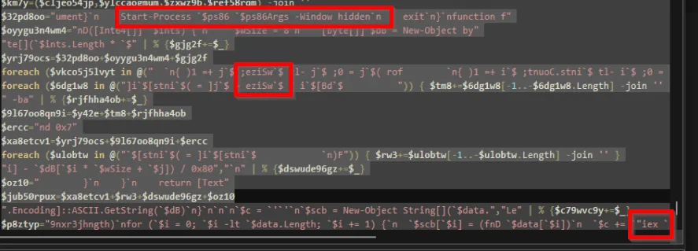
*Reversed strings and Invoke-Expression trigger*

**Stage 2: Reflective DLL Injection**  
Payload injected directly into powershell.exe memory - never written to disk.

**Stage 3: File Encryption**  
AES-256 with randomly generated victim ID (`8Fp4QiPet`).

**Stage 4: Backup Destruction**  
WMI queries to Volume Shadow Copy Service - no vssadmin.exe or wmic.exe commands.

---

## 🔍 Dynamic Analysis

### Behavioral Observations

Process Monitor caught the destructive behavior. PowerShell performed high-volume WriteFile operations, overwriting user documents with encrypted versions (`.8Fp4QiPet` extension).

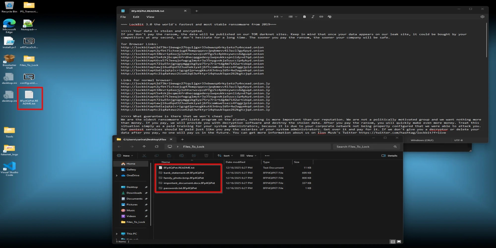
*Bait files encrypted with .8Fp4QiPet extension and ransom note visible*

**Shadow copy deletion:** Registry access patterns showed services.exe triggering VSS, despite zero command-line execution. The malware sent silent COM/RPC requests to Windows system services.

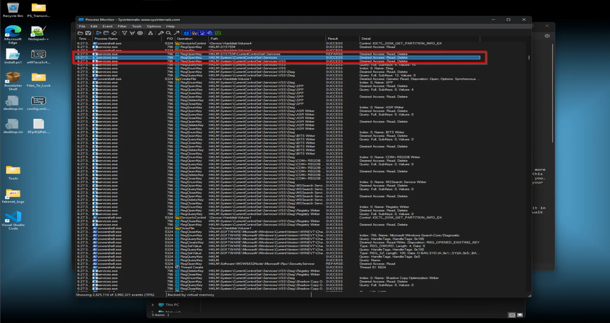
*services.exe accessing Volume Shadow Copy Service registry keys - no vssadmin.exe*

This API-based deletion evades security tools monitoring command-line activity for `vssadmin delete shadows` or `wmic shadowcopy delete`.

### Network Analysis

**Zero C2 traffic.** Wireshark showed the malware checking internet connectivity by pinging public DNS servers (8.8.8.8, 1.1.1.1) - all requests failed in the isolated lab.

**Result:** LockBit operates fully offline with local key generation. This makes it resilient against network-based detection and prevention systems.

---

## 🧠 Memory Forensics

Since the ransomware executed filelessly, memory forensics were required to extract the payload.

**Problem:** First Hollows Hunter scan found nothing - ransomware terminated immediately after encryption.

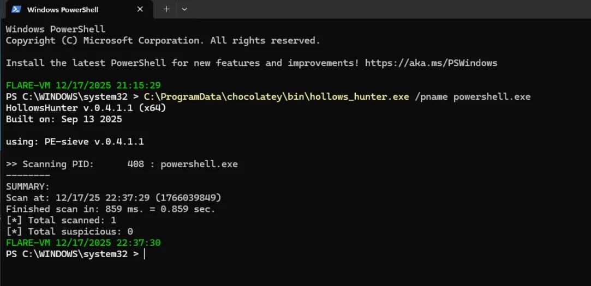
*Initial scan detecting zero suspicious implants due to process termination*

**Solution:** Second execution with careful timing to capture the process while still active. Race against time, but it worked.

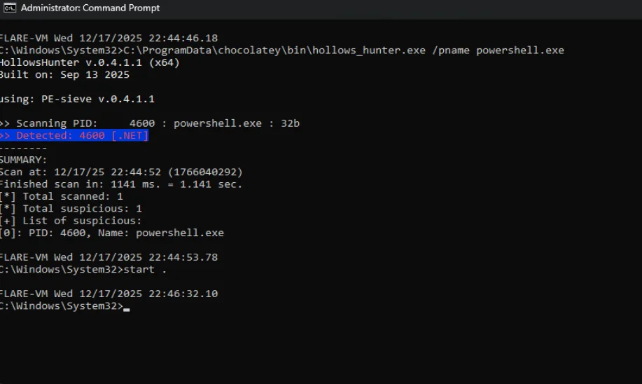
*Detecting injected code in PID 4600 (powershell.exe)*

Extracted payload: `15b10000.dll` (136 KB) - the core ransomware module loaded directly into process memory.

---

## 🔬 Static Analysis

### CAPA Results

Confirmed LockBit 3.0 with high-confidence capabilities:

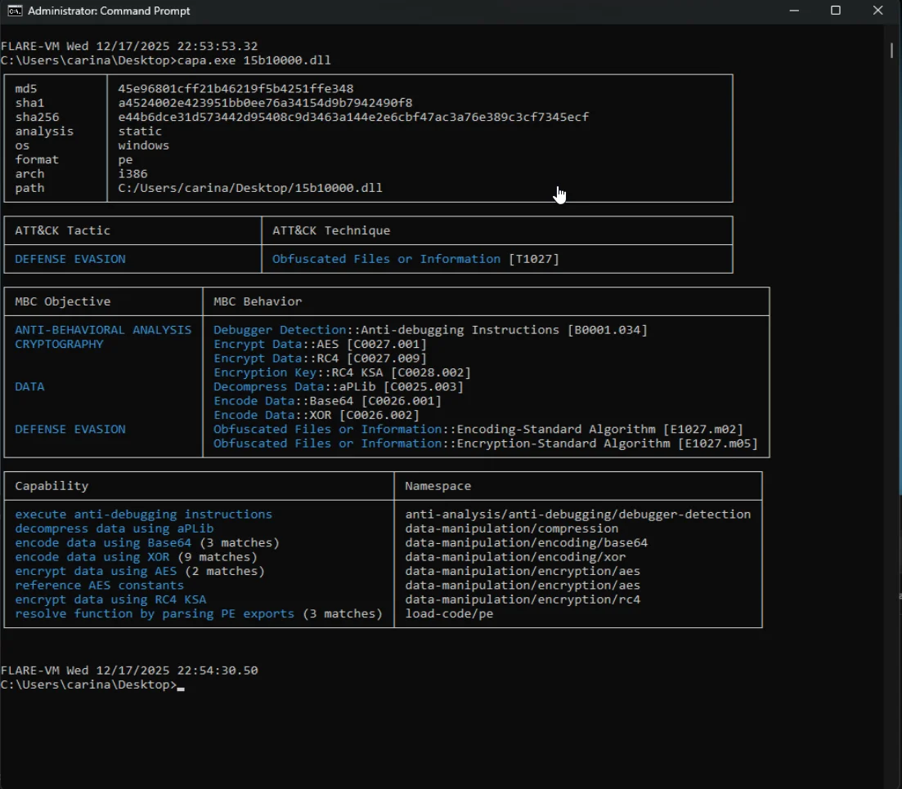
*AES encryption, aPLib compression, and anti-debugging capabilities*

**MITRE ATT&CK Techniques:**
- Defense Evasion: Obfuscated Files [T1027]
- Anti-Behavioral Analysis: Debugger Detection [B0001.034]

**Cryptographic Capabilities:**
- Encrypt Data using AES [C0027.001]
- Encrypt Data using RC4 [C0027.009]
- Reference AES constants

**Data Manipulation:**
- **Decompress Data using aPLib [C0025.003]** ← Signature of LockBit/BlackMatter
- Encode Data using Base64 [C0026.001]
- Encode Data using XOR [C0026.002]

The aPLib compression is a distinctive fingerprint. Most ransomware uses ZIP or LZNT1 - aPLib links this directly to BlackMatter lineage.

### Configuration Extraction

Traditional string extraction failed due to stack string obfuscation. FLOSS (FireEye Labs Obfuscated String Solver) emulated the malware's decoding routines to extract the hidden config.

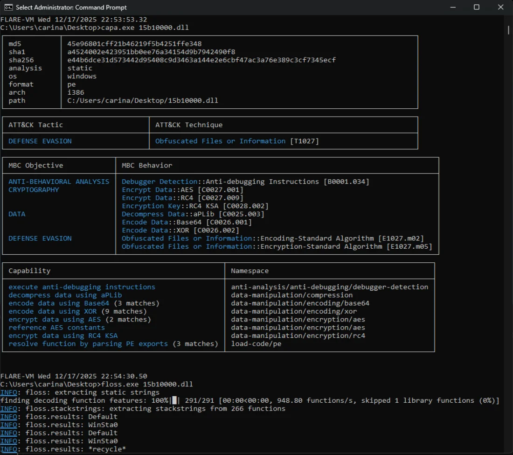
*Decoded strings revealing WMI queries, mutex patterns, and config*

**Ransom Note Config:**
- Template: `%s.README.txt` (victim ID-based naming)
- Alternate: `restore my files.txt`
- Extension: `.8Fp4QiPet` (randomly generated 9-char ID)

**Shadow Copy Destruction:**
- WMI Query: `SELECT * FROM Win32_ShadowCopy`
- Deletion: `Win32_ShadowCopy.ID='%s'`
- Method: Direct WMI queries (not vssadmin.exe)
- Namespace: `ROOT\CIMV2`

**UAC Bypass:**
- CLSID: `{3E5FC7F9-9A51-4367-9063-A120244FBEC7}`
- Technique: COM Elevation (CMSTP)

**Anti-Reinfection Mutex:**
- Pattern: `Global%.8x%.8x%.8x%.8x`
- Prevents multiple infections of the same system

**Network Propagation:**
- LDAP Query: `LDAP://rootDSE`
- AD Enumeration: `defaultNamingContext`, `dNSHostName`
- Domain Awareness: `LDAP://CN=Computers`

The malware can enumerate Active Directory to identify additional encryption targets - capable of lateral movement.

---

## 🔧 Reverse Engineering

### Ghidra Analysis

Loaded the extracted DLL into Ghidra. Entry point showed initialization chain:

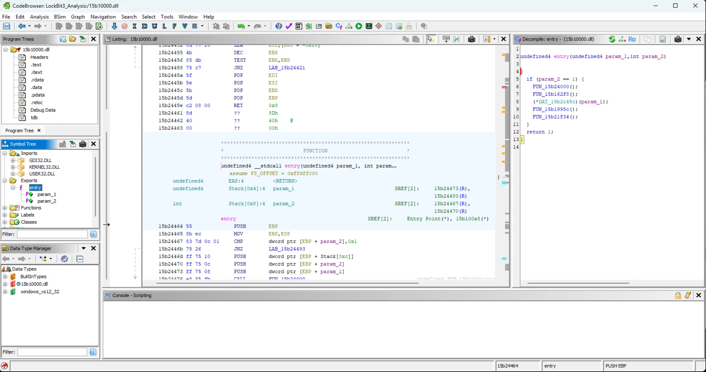
*DLL_PROCESS_ATTACH check and initialization call chain*

**Initialization Chain:**
1. `FUN_15b24000`: Empty stub function (wastes analyst time)
2. `FUN_15b162f8`: API resolution and unpacking routine  
3. `FUN_15b15d78`: Helper function for string decryption

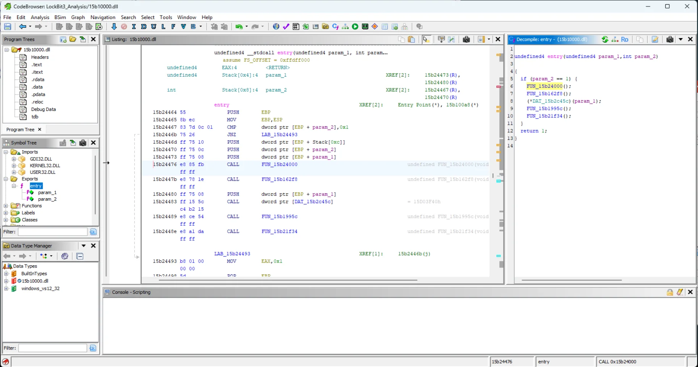
*Stub function with immediate return - time waster*

### API Hashing

Critical Windows APIs like `CoCreateInstance` from ole32.dll (needed for WMI) are absent from the import table. Instead, the malware dynamically resolves them at runtime using a custom hashing algorithm.

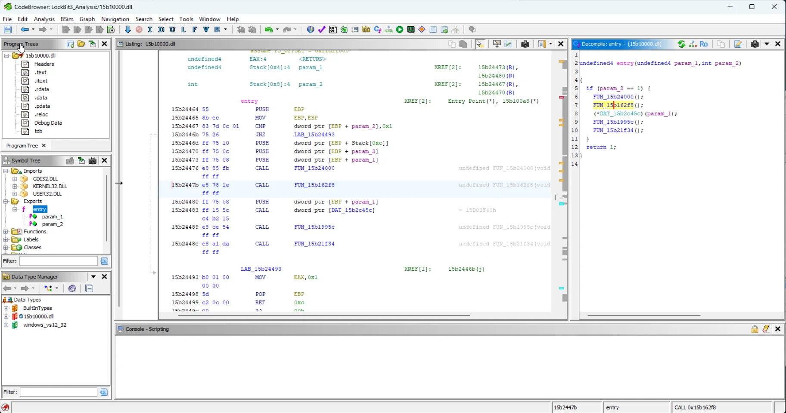
*Repetitive API resolution calls showing dynamic function loading*

**The hashing algorithm:** XOR operation with constant `0x11039ffe`, followed by bitwise rotation.

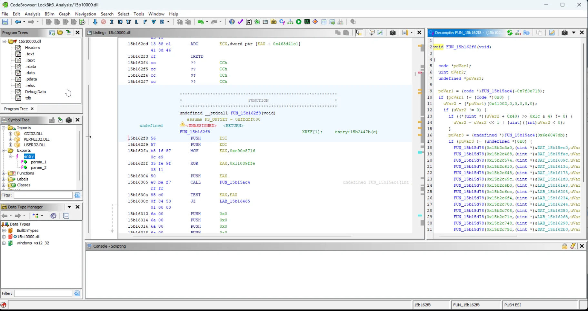
*Decompiled function revealing XOR with 0x11039ffe*

```c
hash = (*param_2 ^ 0x11039ffe)
hash = (hash << (bVar1 & 0x1f)) | hash
```

This creates unique hash values for Windows API function names. The malware compares them against a pre-computed lookup table, retrieves the function address, and executes directly.

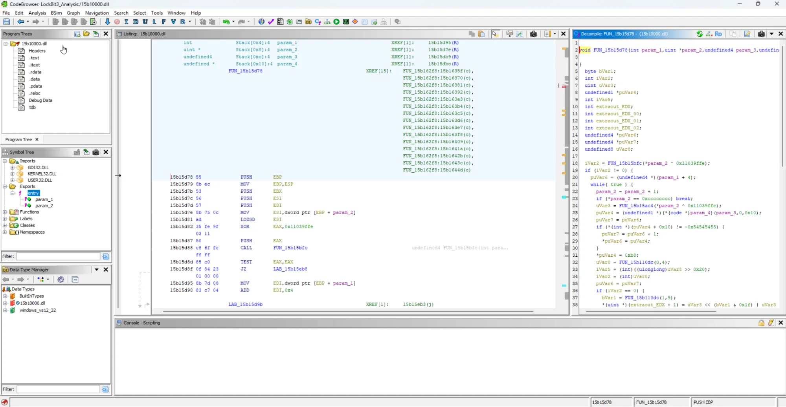
*Full API hashing implementation with XOR constant and bitwise rotation*

### Stack String Obfuscation

Critical strings like `Win32_ShadowCopy` aren't stored in the binary. The malware constructs them character-by-character on the stack at runtime.

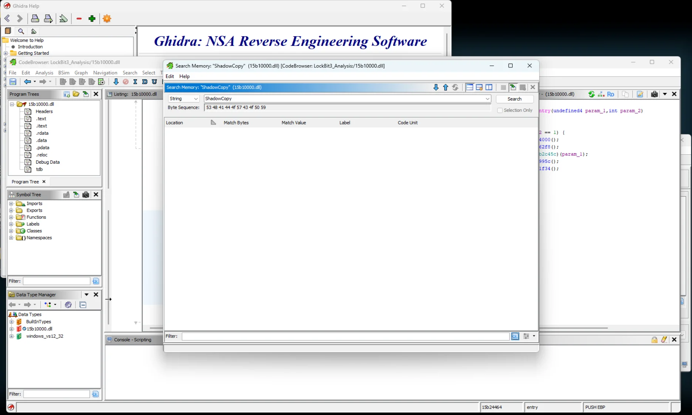
*Ghidra memory search for "ShadowCopy" returning zero results*

Only through FLOSS's emulation were these strings extracted.

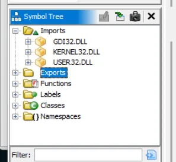
*ole32.dll absent from imports despite WMI usage*

---

## 🔐 Cryptographic Implementation

### Hybrid Encryption Scheme

**Primary Encryption:**
- Algorithm: AES-256 in CBC mode
- Key Generation: Per-file random keys using `BCryptGenRandom`
- Implementation: Windows Crypto API (`BCryptEncrypt`)

**Key Protection:**
- Public Key Cryptography: RSA
- Per-file AES keys encrypted with embedded RSA public key
- Encrypted key appended to each file

**Process:**
1. Generate random AES-256 key for target file
2. Encrypt file contents using AES-256 CBC
3. Encrypt the AES key with embedded RSA public key
4. Append encrypted AES key to file
5. Rename file with `.8Fp4QiPet` extension
6. Securely delete original

Each file gets a unique encryption key - prevents cryptanalysis attacks that might work if a single key encrypted everything.

---

## 🎯 IOCs

| Type | Indicator | Confidence |
|------|-----------|------------|
| **MD5** | `45e96801cff21b46219f5b4251ffe34B` | High |
| **SHA256** | `e44b6dce31d573442d95408c9d3463a144e2e6cbf47ac3a76e389c3cf7345ecf` | High |
| **Extension** | `.8Fp4QiPet` | High |
| **Ransom Note** | `8Fp4QiPet.README.txt` | High |
| **Mutex Pattern** | `Global%.8x%.8x%.8x%.8x` | Medium |
| **WMI Query** | `SELECT * FROM Win32_ShadowCopy` | High |
| **UAC Bypass CLSID** | `{3E5FC7F9-9A51-4367-9063-A120244FBEC7}` | High |
| **LDAP Query** | `LDAP://rootDSE` | Medium |
| **XOR Constant** | `0x11039ffe` | High |
| **Compression** | aPLib (Magic: AP32) | High |

---

## 🛡️ Detection

### YARA Rules

**Reflective Loader Detection:**
```yara
rule LockBit3_Reflective_Loader {
    meta:
        description = "Detects LockBit 3.0 via unique strings and aPLib compression"
        author = "c4r1n4"
    strings:
        $mutex = "Global%.8x%.8x%.8x%.8x" ascii
        $wmi_query = "SELECT * FROM Win32_ShadowCopy" wide
        $readme = "%s.README.txt" ascii
        $ldap = "LDAP://rootDSE" wide
        $uac_bypass = "{3E5FC7F9-9A51-4367-9063-A120244FBEC7}" ascii
        $aplib_magic = { 41 50 33 32 } // aPLib magic bytes "AP32"
        $xor_constant = { FE 9F 03 11 } // 0x11039ffe in little-endian
    condition:
        uint16(0) == 0x5A4D and
        filesize < 500KB and
        3 of ($mutex, $wmi_query, $readme, $ldap) and
        ($aplib_magic or $xor_constant)
}
```

**PowerShell Dropper Detection:**
```yara
rule LockBit3_PowerShell_Dropper {
    meta:
        description = "Detects LockBit 3.0 PowerShell dropper"
    strings:
        $ps1 = "Invoke-Expression" ascii nocase
        $ps2 = "Start-Process" ascii nocase
        $ps3 = "Window hidden" ascii nocase
        $obfuscate1 = "wSize" ascii
        $obfuscate2 = "eziSw" ascii // reversed string
    condition:
        all of them
}
```

### Sigma Rules

**Shadow Copy Deletion via WMI:**
```yaml
title: LockBit Shadow Copy Deletion via WMI
status: experimental
logsource:
    category: process_creation
    product: windows
detection:
    selection:
        Image|endswith: '\\powershell.exe'
        CommandLine|contains:
            - 'Win32_ShadowCopy'
            - 'ROOT\\CIMV2'
    condition: selection
falsepositives:
    - Legitimate backup management scripts
level: high
tags:
    - attack.impact
    - attack.t1490
```

**UAC Bypass via COM Elevation:**
```yaml
title: LockBit UAC Bypass via COM Elevation
detection:
    selection:
        CommandLine|contains: '{3E5FC7F9-9A51-4367-9063-A120244FBEC7}'
    condition: selection
level: high
```

---

## 🔗 MITRE ATT&CK Mapping

| Tactic | Technique | Observed Behavior |
|--------|-----------|-------------------|
| **Execution** | T1059.001 | PowerShell dropper with obfuscated code |
| **Defense Evasion** | T1027 | Stack strings, reversed text, API hashing |
| **Defense Evasion** | T1055 | Reflective DLL injection into powershell.exe |
| **Defense Evasion** | T1140 | Runtime string deobfuscation, aPLib decompression |
| **Privilege Escalation** | T1548.002 | COM elevation via CLSID bypass |
| **Discovery** | T1069.002 | LDAP queries to Active Directory |
| **Discovery** | T1082 | Registry queries for system info |
| **Impact** | T1486 | AES-256 encryption of user files |
| **Impact** | T1490 | WMI-based Volume Shadow Copy deletion |
| **Impact** | T1489 | Service termination (EventLog, SQL, Exchange) |

---

## 📊 Sample Classification

**This is a builder variant,** not an operational sample. Evidence:

- Clean execution without anti-analysis crashes
- Randomly generated victim ID (`8Fp4QiPet`) consistent with builder output
- Source: MalwareBazaar (researcher/sandbox submission)
- No target-specific customization (generic config)

In September 2022, the LockBit 3.0 builder was leaked by a disgruntled affiliate. This sample exhibits characteristics consistent with builder-generated payloads.

**Operational samples** typically have:
- Customized ransom notes with victim org names
- Target-specific configuration
- Additional lateral movement tools
- Data exfiltration modules

This sample lacks those - likely generated for research/testing, not deployed in an actual attack.

---

## 💡 Key Takeaways

**aPLib compression = BlackMatter lineage:** LockBit 3.0 inherited code from BlackMatter, which itself was a DarkSide rebrand after Colonial Pipeline. This evolutionary chain shows threat actor persistence and adaptation.

**API-based shadow copy deletion evades most monitoring:** Security tools watch for `vssadmin.exe delete shadows` or `wmic shadowcopy delete`. LockBit uses WMI queries through COM/RPC - silent, no command-line artifacts.

**API hashing with XOR 0x11039ffe:** Custom hashing algorithm hides Windows function imports. Static analysis can't see what APIs the malware uses without reverse engineering the hash function.

**Fileless execution defeats disk-based detection:** Reflective DLL injection means the payload never touches disk. Traditional AV scanning files at rest won't catch it.

**Offline encryption = network detection bypass:** No C2 traffic means network-based detection and prevention systems can't block it. Keys generated locally, encryption happens entirely offline.

---

## 🔧 Tools Used

- **FLARE-VM** - Windows malware analysis environment
- **REMnux** - Linux analysis toolkit with INetSim  
- **Hollows Hunter** - Memory payload extraction
- **Ghidra** - NSA reverse engineering framework
- **FLOSS** - FireEye Labs Obfuscated String Solver
- **CAPA** - Mandiant capability analysis framework
- **Wireshark** - Network traffic analysis
- **Process Monitor** - File system and registry monitoring
- **YARA** - Pattern matching for malware detection
