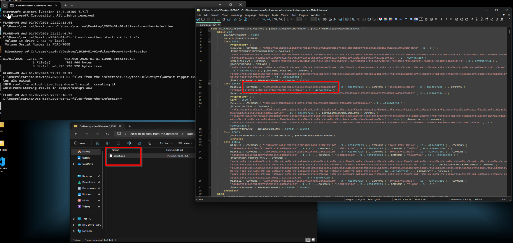
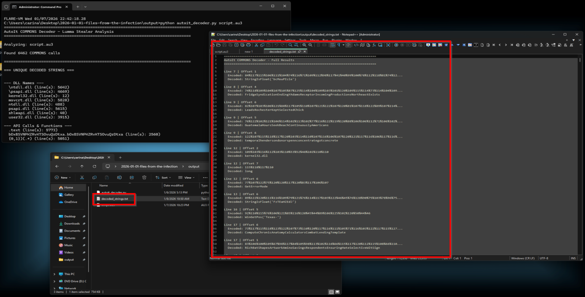
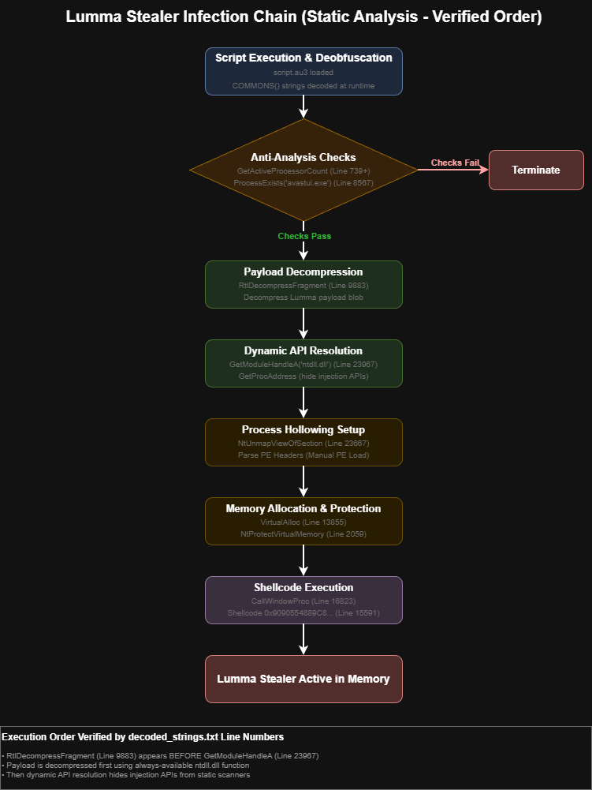
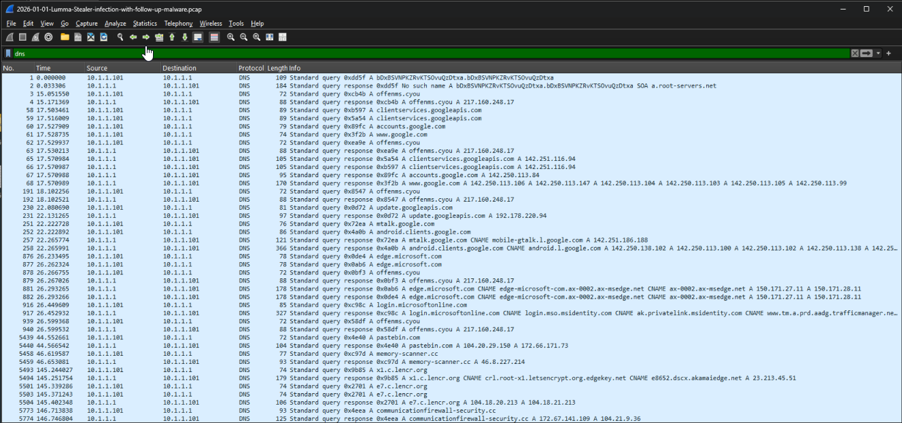
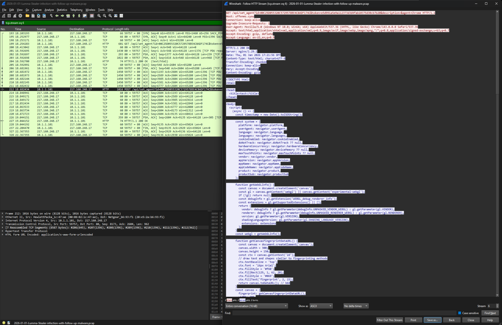
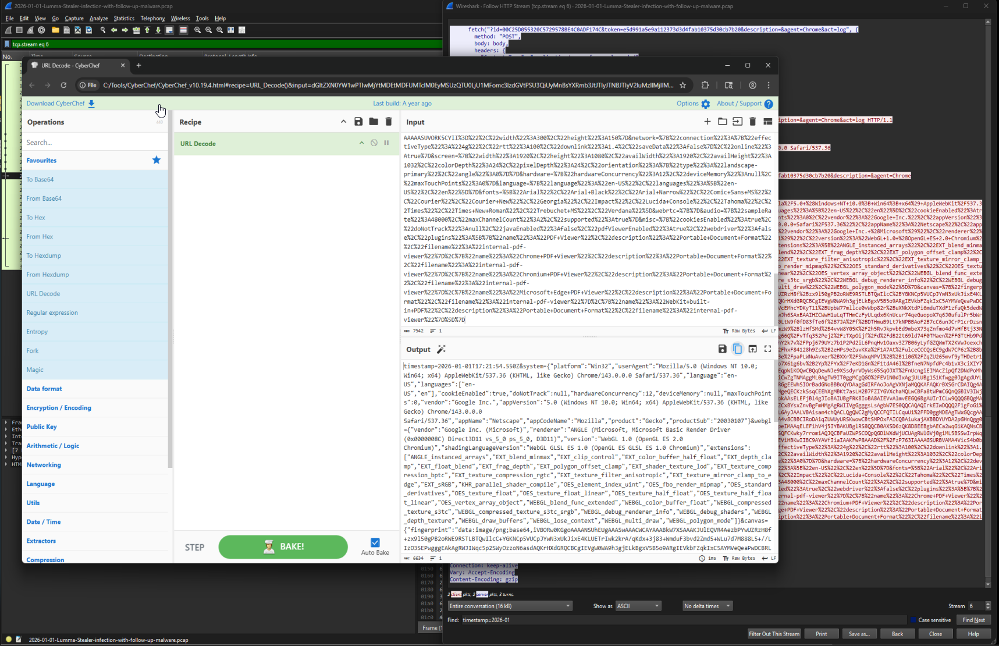
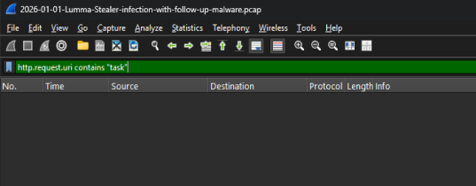
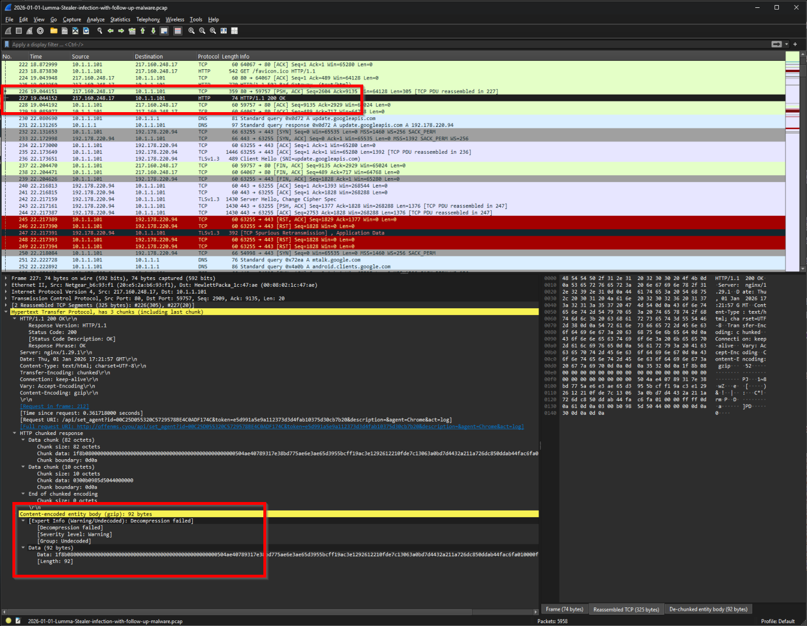
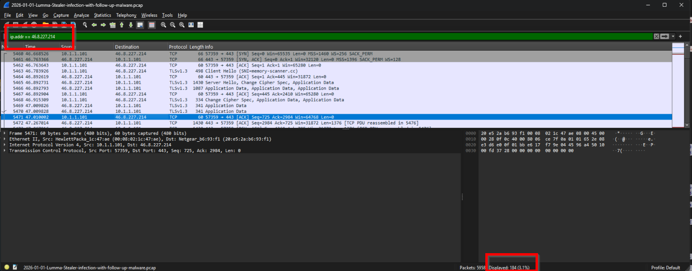
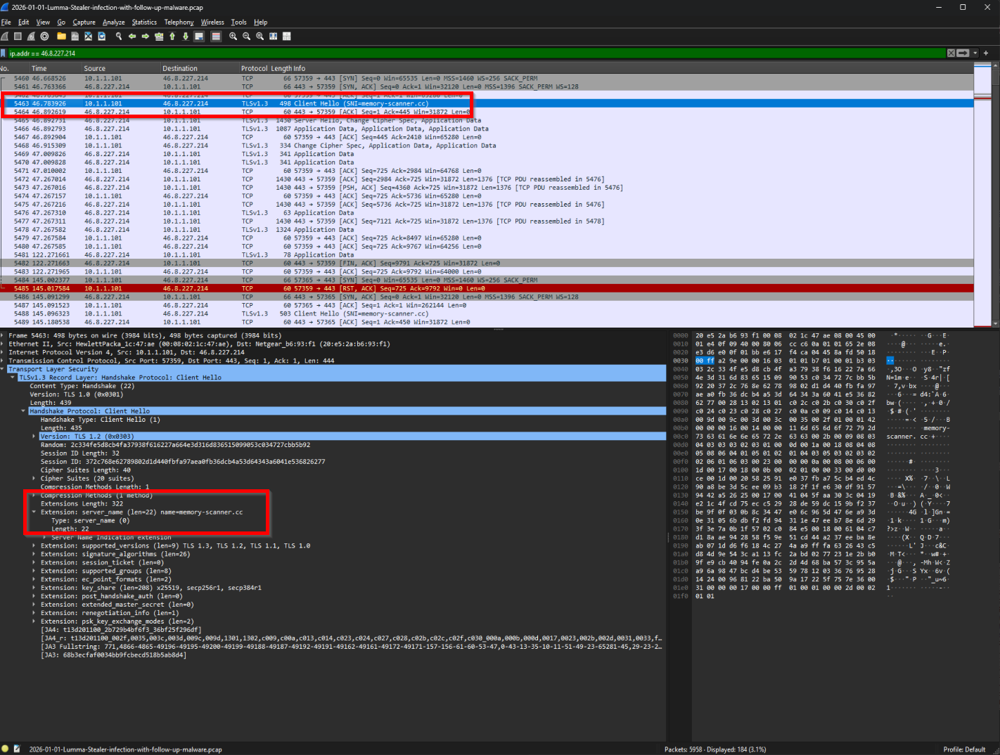

# Lumma Stealer 🎭

**AutoIt loader with process hollowing and network traffic forensics**

Tore apart a post-takedown Lumma sample to understand how it survived the May 2025 Microsoft/DOJ operation. Decoded COMMONS obfuscation, mapped the 8-step infection chain, and analyzed C2 fingerprinting via JavaScript injection.

**Source:** [malware-traffic-analysis.net](https://www.malware-traffic-analysis.net/2026/01/01/index.html) (Brad Duncan) | **Captured:** January 1, 2026

---

## 🎯 What Makes This Interesting

Lumma isn't just stealing credentials anymore. It's evolved into an initial access loader that profiles victims with JavaScript fingerprinting, then deploys follow-up malware over encrypted channels. The AutoIt loader uses process hollowing to inject the payload without dropping files to disk, and the whole thing rebuilt its infrastructure within months of the DOJ takedown. Resilient little bastard.

---

## 📋 Sample Info

| Attribute | Value |
|-----------|-------|
| **Primary Loader** | `2026-01-01-Lumma-Stealer.a3x` (AutoIt compiled script) |
| **Interpreter** | `Treat.exe` (renamed AutoIt3.exe) |
| **C2 Domain** | `offenms.cyou` → `217.160.248.17` |
| **Victim ID** | `00C25D055320C5729578BE4C0ADF174C` |
| **Follow-up Domains** | `memory-scanner.cc`, `pastebin.com`, `communicationfirewall-security.cc` |

---

## 🔬 Static Analysis

### AutoIt Script Decompilation

Used `autoit-ripper` to reverse the tokenized bytecode back to source. The decompiled `script.au3` is a mess of obfuscated calls:

```
COMMONS("109%103%116%...", 3 + 4294967295)
```

Every sensitive string (API names, DLL paths, config data) is encoded as percent-separated ASCII values. The malware author didn't want anyone seeing `kernel32.dll` or `NtProtectVirtualMemory` in plain text.



### Obfuscation Analysis

I'll be honest. I tried using FLOSS first and wasted time. FLOSS is for compiled Windows binaries (.exe, .dll) with machine code. AutoIt scripts are human-readable source code, so FLOSS just stared at it confused. Lesson learned.

Borrowed a friend's Python script that actually handles AutoIt's COMMONS obfuscation. After breaking the encoding layer, I found the good stuff:



### What The Decoded Strings Revealed

**1. Process Hollowing (Manual PE Loading)**

The script isn't dropping a file. It's manually mapping a payload into memory:

- Line 488: `NtProtectVirtualMemory` - changes memory permissions to executable
- Line 5523: `NtUnmapViewOfSection` - hollows out a process to make room
- Line 5714: PE header parsing (`Magic[2]`, `AddressOfNewExeHeader`) - manual injection

**2. Dynamic API Resolution**

Hiding imports from static analysis:

- Line 15591: `GetModuleHandleA`
- Line 15599: `ntdll.dll`

Instead of listing suspicious APIs in the import table where AV can spot them, Lumma resolves them at runtime. By the time the APIs are called, security products already let the process run.

**3. Shellcode & Execution**

- Line 3645: `0x9090554889C8...` - raw x64 shellcode (NOP sled + PUSH RBP)
- Line 3915: `CallWindowProc` - classic trick to execute shellcode buffers

**4. Anti-Sandbox Checks**

- Line 466: `GetActiveProcessorCount` - VMs usually have limited CPU cores
- Line 1982: `ProcessExists` - hunting for `avastui.exe` (Avast AV)

**5. Payload Location**

- Line 2314: `RtlDecompressFragment` - the Lumma payload is stored compressed inside script variables

---

## 🔗 Infection Chain

After decoding everything, I mapped the execution flow by tracking API call line numbers. This revealed an 8-step infection chain using process hollowing to inject Lumma without dropping the final payload to disk.



### Step-by-Step Breakdown

**Step 1: Script Execution & Deobfuscation**

AutoIt interpreter loads `script.au3` and starts decoding COMMONS strings at runtime. Every sensitive string gets decoded dynamically, making static analysis harder without building a decoder first.

**Step 2: Anti-Analysis Checks**

Before doing anything malicious, the script checks if it's in a sandbox. `GetActiveProcessorCount` (line 739) looks for limited CPU cores (VMs usually have 1-4). Also hunts for `avastui.exe` (line 8567). If checks fail, it terminates. This is something I dealt with constantly at Carbon Black. Samples refusing to detonate in analysis VMs.

**Step 3: Payload Decompression**

`RtlDecompressFragment` (line 9883) decompresses the Lumma binary stored as a blob in the script. This is a legitimate Windows API, so it doesn't raise alarms. The decompressed payload only exists in memory at this point.

**Step 4: Dynamic API Resolution**

`GetModuleHandleA` (line 23967) locates `ntdll.dll`, then `GetProcAddress` finds the injection APIs. This hides `NtUnmapViewOfSection` and friends from import table scanners.

**Step 5: Process Hollowing Setup**

`NtUnmapViewOfSection` (line 23667) unmaps legitimate code from the target process. The script then manually parses PE headers to prepare for injection.

**Step 6: Memory Allocation & Protection**

`VirtualAlloc` (line 13855) allocates memory. `NtProtectVirtualMemory` (line 2059) sets PAGE_EXECUTE_READ permissions. Can't run code from non-executable memory.

**Step 7: Shellcode Execution**

Shellcode at line 15591 gets executed via `CallWindowProc` (line 16823). This API is normally for window message handling, but malware abuses it because it accepts function pointers.

**Step 8: Lumma Stealer Active**

Payload runs inside the hollowed process. From forensics perspective, the process looks legitimate but contains completely replaced malicious code.

**Key Insight:** Decompression happens before API resolution (line 9883 vs 23967). Makes sense. `RtlDecompressFragment` is always available in ntdll.dll and doesn't raise suspicion. The injection APIs are the suspicious ones, so those get resolved dynamically.

---

## 🌐 Network Traffic Analysis

After static analysis, I needed to see what actually happened on the wire. Brad's PCAP captures everything from execution through exfiltration.

### DNS Analysis



**DGA Attempt (Failed):**
- Frames 1-2: Tried to resolve `bDxBSVNPKZRvKTSOvuQzDtxa.bDxBSVNPKZRvKTSOvuQzDtxa`
- Response: "No such name"
- This is a randomly generated fallback domain. When it failed, Lumma used its hardcoded C2.

**Primary C2:**
- Frames 4, 63, 192, 879, 940: `offenms.cyou` → `217.160.248.17`
- Matches Brad's IOC list ✓

**Follow-up Infrastructure:**
- Frame 5440: `pastebin.com` → 104.20.29.150 (config hosting)
- Frame 5459: `memory-scanner.cc` → 46.8.227.214 (suspicious name)
- Frame 5774: `communicationfirewall-security.cc` → 172.67.141.109 (fake security branding)

### HTTP Stream Analysis - C2 Fingerprinting

Frame 212 captured the complete C2 conversation. Two-stage process:

**Stage 1: Initial Registration**
```
GET /api/set_agent?id=00C25D055320C5729578BE4C0ADF174C&token=e5d991a5e9a112373d3d4fab10375d30cb7b20&agent=Chrome
```

**Stage 2: JavaScript Fingerprinting**

The C2 responded with JavaScript that collects:
- OS, browser version, CPU cores
- WebGL renderer (GPU hardware ID)
- Canvas fingerprint (unique tracking signature)
- Screen resolution, network speed
- Installed fonts, browser plugins

**Stage 3: Data Exfiltration**
```
POST /api/set_agent?...&act=log
```
7,942 bytes of fingerprint data sent back. Server confirmed with HTTP 200.

### Decoding Exfiltrated Data

The POST body was URL-encoded garbage. Threw it into CyberChef with URL Decode:



**Decoded Victim Profile:**

| Attribute | Value |
|-----------|-------|
| Timestamp | 2026-01-01T17:21:54.550Z |
| System | Windows 10 x64, Chrome 143, 12 CPU cores |
| WebGL | Microsoft Basic Render Driver (VM indicator) |
| Screen | 1920x1080, 24-bit |
| Network | 4G, 100ms latency, 1.4 Mbps |
| PDF Viewers | 5 (Chrome, Edge, Chromium, WebKit, generic) |

The WebGL renderer showing "Microsoft Basic Render Driver" indicates a VM, but 12 CPU cores suggests a well-resourced analysis system rather than a typical 2-core sandbox. The multiple PDF viewers tell Lumma that Chrome and Edge are both installed, so it knows which credential stores to target.

### Searching for C2 Tasking Commands

I wanted to find how the C2 told Lumma to download follow-up malware. Applied filter `http.request.uri contains "task"` looking for `/api/get_task` or similar.



No packets found.

Examined Frame 227's response (gzip, 92 bytes). Tried to decompress:



Wireshark showed "Decompression failed" warning.

**Conclusion:** The tasking commands weren't in plaintext HTTP. They're either:
- Sent over HTTPS (encrypted)
- Hardcoded in the Lumma payload
- Communicated through a channel not in this PCAP

This is a gap in the observable infection chain. We see fingerprinting and follow-up downloads, but the orders connecting them are hidden.

### Follow-Up Malware Downloads

Pivoted to analyzing what I could see. Applied filter `ip.addr == 46.8.227.214` (memory-scanner.cc):



**Connection (Frames 5460-5462):**
- TCP handshake to port 443 (HTTPS)
- Victim initiating connection to memory-scanner.cc

**TLS Handshake (Frame 5463):**



- TLS 1.3 Client Hello with SNI extension
- SNI value: `memory-scanner.cc` (proves destination despite encryption)
- 20 cipher suites offered

**Encrypted Transfer (Frames 5622-5770):**
- ~184 packets of TLS Application Data
- ~100KB+ total (pattern consistent with file download, not beaconing)



**Why This Matters:**

Even without decryption keys, the traffic reveals:
1. Confirmed malicious infrastructure (suspicious domain name + large transfer)
2. HTTPS evasion (network security can't inspect)
3. Successful download (clean connection teardown)
4. Multi-stage attack (Lumma acts as initial access loader)

---

## 🎯 Detection Engineering

### YARA Rules

```yara
rule Lumma_Stealer_AutoIt_Loader {
    meta:
        description = "Detects Lumma Stealer AutoIt loader via COMMONS obfuscation"
        author = "Carina"
        date = "2026-01-10"
        reference = "malware-traffic-analysis.net"
    
    strings:
        $commons = "COMMONS(" ascii
        $autoit_sig = "#AutoIt3Wrapper" ascii
        $api1 = "NtProtectVirtualMemory" ascii wide
        $api2 = "NtUnmapViewOfSection" ascii wide
        $api3 = "RtlDecompressFragment" ascii wide
        $api4 = "CallWindowProc" ascii wide
        $api5 = "GetActiveProcessorCount" ascii wide
        $shellcode = { 90 90 55 48 89 C8 }
    
    condition:
        $commons and $autoit_sig and 2 of ($api*) or $shellcode
}

rule Lumma_Stealer_C2_Communication {
    meta:
        description = "Detects Lumma Stealer C2 communication patterns"
        author = "Carina"
        date = "2026-01-10"
    
    strings:
        $endpoint = "/api/set_agent" ascii wide
        $param1 = "act=log" ascii
        $param2 = "agent=Chrome" ascii
        $param3 = "agent=Edge" ascii
    
    condition:
        $endpoint and ($param1 or $param2 or $param3)
}
```

### Sigma Rules

```yaml
title: Lumma Stealer AutoIt Loader Execution
status: experimental
author: Carina
date: 2026/01/10
logsource:
    category: process_creation
    product: windows
detection:
    selection:
        Image|endswith:
            - '\autoit3.exe'
            - '\treat.exe'
        CommandLine|contains: '.a3x'
    condition: selection
level: high
tags:
    - attack.execution
    - attack.t1059

---
title: Lumma Stealer C2 Domain Resolution
status: experimental
author: Carina
date: 2026/01/10
logsource:
    category: dns_query
    product: windows
detection:
    selection:
        QueryName|endswith:
            - '.cyou'
            - 'memory-scanner.cc'
            - 'communicationfirewall-security.cc'
    condition: selection
level: high
tags:
    - attack.command_and_control
    - attack.t1071
```

---

## 📊 IOCs

| Type | Indicator | Confidence |
|------|-----------|------------|
| C2 Domain | `offenms.cyou` | High |
| C2 IP | `217.160.248.17` | High |
| Follow-up Domain | `memory-scanner.cc` | High |
| Follow-up IP | `46.8.227.214` | High |
| Follow-up Domain | `communicationfirewall-security.cc` | High |
| Follow-up IPs | `172.67.141.109`, `104.21.9.36` | High |
| Staging | `pastebin.com` | Medium |
| Victim ID Pattern | `00C25D055320C5729578BE4C0ADF174C` | High |
| API Endpoint | `/api/set_agent` | High |
| Exfil Parameter | `act=log` | High |
| Loader | `Treat.exe` (AutoIt3.exe) | Medium |
| Script Extension | `.a3x` | Medium |
| Obfuscation | `COMMONS()` pattern | High |

---

## 🗺️ MITRE ATT&CK

| Tactic | ID | Technique | Observed |
|--------|-----|-----------|----------|
| Execution | T1059.010 | AutoIt Scripting | AutoIt loader (Treat.exe + .a3x) |
| Defense Evasion | T1027 | Obfuscated Files | COMMONS() string encoding |
| Defense Evasion | T1055.012 | Process Hollowing | NtUnmapViewOfSection injection |
| Defense Evasion | T1140 | Deobfuscate/Decode | Runtime string decoding |
| Defense Evasion | T1497 | Sandbox Evasion | GetActiveProcessorCount checks |
| Discovery | T1082 | System Info Discovery | JavaScript fingerprinting |
| Credential Access | T1555.003 | Browser Credentials | Chrome/Edge credential theft |
| Exfiltration | T1041 | Exfil Over C2 | POST to /api/set_agent |
| C2 | T1071.001 | Web Protocols | HTTP/HTTPS C2 |
| C2 | T1573 | Encrypted Channel | TLS 1.3 downloads |

---

## 💡 Key Takeaways

**Lumma survived the takedown:** The May 2025 Microsoft/DOJ operation seized ~2,300 domains. Within months, infrastructure was rebuilt and operations resumed. MaaS resilience is real.

**It's not just a stealer anymore:** Lumma evolved into an initial access loader. The connections to memory-scanner.cc and communicationfirewall-security.cc show a single infection is just the beginning.

**JavaScript fingerprinting is thorough:** CPU cores, WebGL renderer, canvas fingerprint, installed fonts, browser plugins. This profile helps attackers decide if a victim is worth deploying additional payloads against (or if it's a sandbox).

**HTTPS blinds network security:** All follow-up downloads happened over TLS 1.3. Traditional inspection can't see what's being downloaded without TLS interception capabilities.

**AutoIt + process hollowing = disk-based AV bypass:** The payload never touches disk. Signature-based AV scanning files at rest won't catch it.

**Decompression before API resolution is smart:** `RtlDecompressFragment` is in ntdll.dll (always loaded, not suspicious). The injection APIs are what trigger alerts, so those get resolved dynamically to evade static analysis.

---

## 🔧 Tools Used

- **FLARE-VM** - Windows malware analysis environment
- **REMnux** - Linux analysis toolkit
- **autoit-ripper** - AutoIt script decompiler
- **Wireshark** - Network traffic analysis
- **CyberChef** - Data decoding/transformation
- **Custom Python** - COMMONS obfuscation decoder (borrowed from a friend)
- **Draw.io** - Infection chain diagram

---

## 📚 References

- [Brad Duncan - Malware Traffic Analysis](https://www.malware-traffic-analysis.net/2026/01/01/index.html)
- [Microsoft Security Blog - Lumma Stealer Takedown (May 2025)](https://www.microsoft.com/security/blog/)
- [MITRE ATT&CK Framework](https://attack.mitre.org/)
