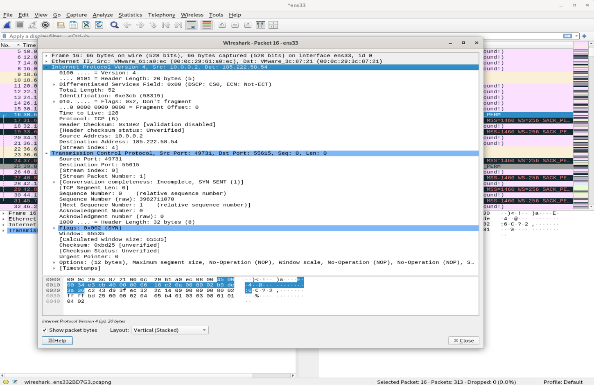
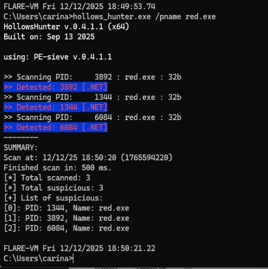
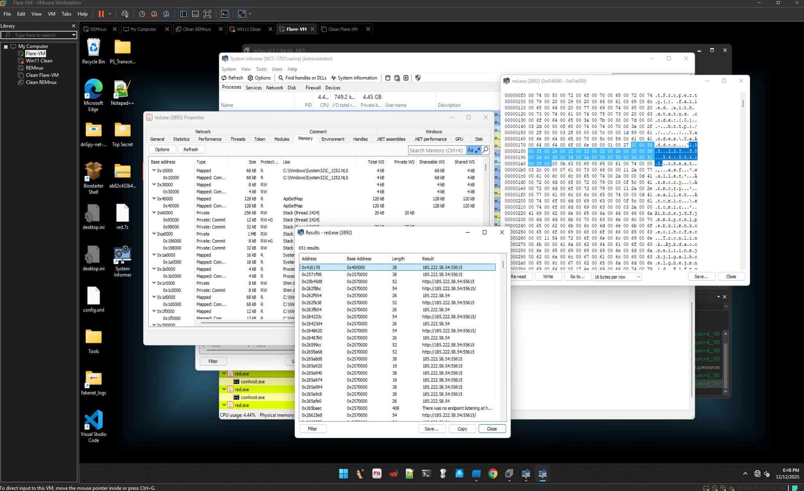
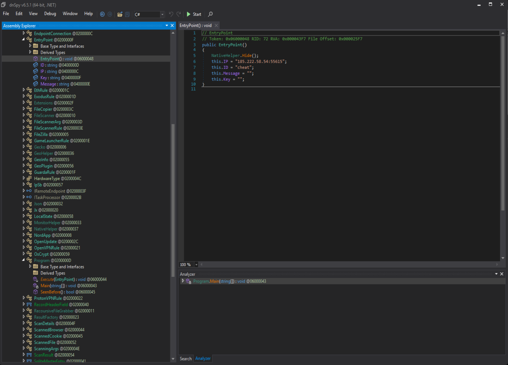
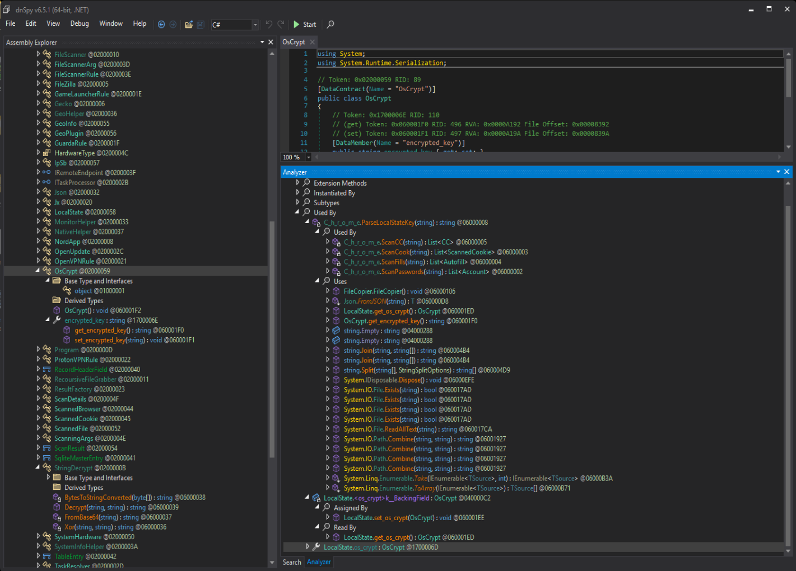

# RedLine Stealer 🦠

**Info stealer exploiting Windows DPAPI to decrypt browser passwords**

Campaign targeted game cheat forums (campaign ID: "cheat"). I unpacked this from memory mid-execution, reverse engineered the DPAPI exploitation, and built IOC extraction tooling.

**C2:** `185.222.58.54:55615` | **Protocol:** HTTP/SOAP | **Campaign:** cheat

---

## 🎯 What This Thing Does

RedLine is credential theft malware that exploits how Windows protects data. Instead of breaking Chrome's encryption, it just asks Windows nicely to decrypt everything. Windows says "sure!" and hands over your passwords. Not a bug - that's literally how DPAPI works.

**Targeted Data:**
- 🌐 Browser passwords (Chrome, Firefox)
- 🍪 Cookies and autofill data  
- 💳 Saved credit cards
- 🔐 FTP credentials (FileZilla)
- 💰 Cryptocurrency wallets

---

## 🏗️ Lab Setup

Built a completely isolated environment - no real internet, just two VMs talking to each other.

| Component | What It Does |
|-----------|-------------|
| **Windows VM** | FLARE-VM (Windows 11) with malware analysis tools |
| **Linux VM** | REMnux running INetSim to fake the internet |
| **Network** | Isolated 10.0.0.0/24 - zero external connectivity |

**Tools used:** Wireshark, dnSpy, Hollows Hunter, System Informer, Process Monitor

---

## 🔬 Analysis Phases

### Phase 1: Dynamic Analysis 

Fired it up with Wireshark and Process Monitor running. Watched it beacon home immediately.

**C2 Communication:**
- Server: `185.222.58.54:55615`
- Protocol: HTTP with SOAP
- First action: `CheckConnect` beacon to http://tempuri.org/Endpoint/CheckConnect
- This SOAP endpoint is pretty unique to RedLine - solid detection signature


*Wireshark showing CheckConnect beacon - note the tempuri.org SOAP action*

### Phase 2: Memory Forensics 

The sample was packed - couldn't decompile it directly. Had to grab it from memory while running.

**The trick:** System Informer showed me the C2 IP in memory before I even finished unpacking. Then used Hollows Hunter to dump the clean .NET assembly from RAM.


*Hollows Hunter catching the unpacked payload in PID 4600 (powershell.exe)*

**Before unpacking:** Garbage strings, no readable code  
**After unpacking:** Clean .NET assembly that dnSpy could read perfectly


*C2 IP visible in process memory before unpacking even completed*

### Phase 3: Reverse Engineering

Loaded the clean binary into dnSpy. Config was right there in the EntryPoint class:

```csharp
this.IP = "185.222.58.54:55615";
this.ID = "cheat";
this.Message = "";
this.Key = "";
```

That "cheat" campaign ID = game hacking forums. Makes sense - people downloading sketchy trainers/bots aren't thinking about security.


*Configuration hardcoded in EntryPoint class*

---

## 🔓 The DPAPI Trick

Here's the interesting part. Chrome encrypts passwords using Windows DPAPI (Data Protection API). Problem: **DPAPI will decrypt stuff for any process running as you.**

**Attack chain:**
1. Find Chrome's `Local State` file (contains encrypted master key)
2. Pull out the `encrypted_key` from JSON
3. Call `ProtectedData.Unprotect()` - Windows decrypts it, no questions asked
4. Use that master key to decrypt the password database

```csharp
array = ProtectedData.Unprotect(EncryptedData, entropy, 
    DataProtectionScope.CurrentUser);
```

This isn't a vulnerability that can be patched. It's how DPAPI is designed. If malware runs as your user, it can decrypt anything DPAPI-protected. Defense needs to happen at the behavioral detection layer, not encryption.


*ProtectedData.Unprotect() call - Windows hands over the keys*

**Other targeted applications:**
- `C_h_r_o_m_e`: Passwords, cookies, autofill, credit cards
- `Gecko`: Firefox and Mozilla-based browsers
- `FileZilla`: FTP credentials
- `AllWalletsRule`: Cryptocurrency wallets


*Modules for stealing from different applications*

---

## 🎯 IOCs

| Type | Indicator | Confidence |
|------|-----------|------------|
| Network | `185.222.58.54:55615` | High |
| SOAP Signature | `tempuri.org/Endpoint/CheckConnect` | High |
| Campaign ID | `cheat` | Medium |

---

## 🛡️ Detection

**YARA Rule:**
Detects the unpacked version by looking for unique strings in decompiled code.

**Python IOC Extractor:**
Automatically pulls IP addresses from malware samples using regex. Filters out version numbers and localhost. Runs in under a second.

**Network Detection:**
- Outbound connections to port 55615 (non-standard port)
- SOAP traffic to tempuri.org endpoints
- Traffic to 185.222.58.54

---

## 💡 Key Takeaways

**The DPAPI problem:** Chrome's encryption doesn't matter if malware runs as your user. Windows will decrypt anything DPAPI-protected for processes in your security context. This is by design, not a bug.

**Distribution vector:** Game cheat forums target users already bypassing security (disabled AV, ignoring warnings). They're the perfect victims.

**Detection strategy:** The SOAP beacon to tempuri.org/Endpoint/CheckConnect persists across RedLine variants. Unlike C2 IPs that change constantly, this behavioral pattern is harder for attackers to modify without rewriting core functionality.

**Tooling matters:** The Python automation tool reduces IOC extraction from hours to seconds. Critical for SOC teams dealing with high sample volumes.

---

## 🔧 Tools Used

- **FLARE-VM** - Windows malware analysis environment
- **REMnux** - Linux analysis toolkit with INetSim
- **Wireshark** - Network traffic capture
- **dnSpy** - .NET decompiler
- **Hollows Hunter** - Memory payload extraction
- **System Informer** - Process memory inspection
- **Process Monitor** - File system activity monitoring
- **Python** - IOC extraction automation
